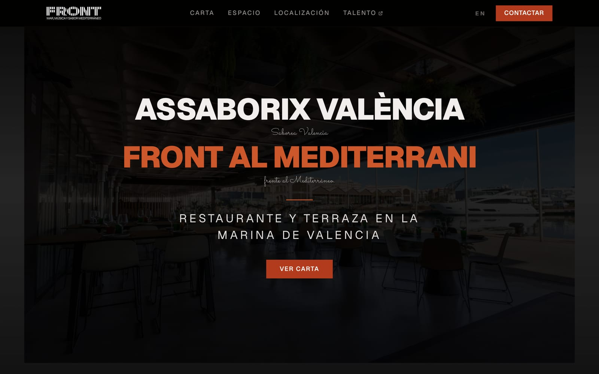

# FRONT Valencia

> Web oficial del restaurante **FRONT Valencia** — Restaurante y Terraza en La Marina de Valencia, frente al Mediterráneo.

Sitio moderno, rápido y bilingüe (ES/EN), construido como monorepo con Astro + React en el frontend y Payload CMS para que el equipo edite carta, horarios e imágenes sin tocar código.

<p>
  <a href="https://github.com/Iniciativas-Alexendros/website-frontvalencia/actions/workflows/ci.yml"></a>
  
  
  
  
</p>



## Características

- **Carta digital** bilingüe con alérgenos, etiquetas dietéticas y precios.
- **Espacios y eventos** con galería, descripciones y contacto para reservas privadas.
- **Reservas** integradas con CoverManager.
- **Localización** con mapa, transporte y horarios.
- **Páginas legales** (aviso legal, privacidad, cookies, condiciones de reserva).
- **Panel de administración** sencillo para editar el contenido sin programar.

## Stack

| Capa       | Tecnología                         |
| ---------- | ---------------------------------- |
| Frontend   | Astro (SSG) + React + Tailwind CSS |
| CMS        | Payload CMS + PostgreSQL           |
| Monorepo   | pnpm workspaces + Turborepo        |
| Lenguaje   | TypeScript (estricto)              |
| Despliegue | Vercel (web) · Railway (CMS)       |

## Inicio rápido

```bash
git clone https://github.com/Iniciativas-Alexendros/website-frontvalencia.git
cd website-frontvalencia
pnpm install
cp .env.example .env      # configura las variables de entorno
pnpm dev                  # arranca CMS (:3001) y web (:4321)
```

- Web: <http://localhost:4321/es/>
- Panel de administración: <http://localhost:3001/admin> (requiere PostgreSQL)

## Scripts

| Comando          | Descripción                        |
| ---------------- | ---------------------------------- |
| `pnpm dev`       | Desarrollo en paralelo (CMS + web) |
| `pnpm build`     | Build de producción                |
| `pnpm test`      | Tests unitarios y E2E              |
| `pnpm lint`      | Formato y comprobación de tipos    |
| `pnpm typecheck` | Verificación de tipos TypeScript   |

Entorno con Docker: `pnpm docker:dev` (levanta Postgres + CMS + web), `pnpm docker:down` para detener.

## Estructura

```
website-frontvalencia/
├── apps/
│   ├── cms/            # Payload CMS (colecciones, acceso, plugins)
│   └── web/            # Astro + React (páginas ES/EN, componentes, estilos)
├── packages/types/     # Tipos TypeScript compartidos
├── docs/               # Documentación técnica y decisiones (ADR)
└── .github/workflows/  # CI/CD y automatización de releases
```

## Despliegue y releases

Cada push a `main` ejecuta el pipeline (formato, tipos, tests, build) y despliega
la web en Vercel. El versionado es automático con
[Changesets](https://github.com/changesets/changesets): al mergear cambios con un
changeset se abre un PR `ci: version packages` que, al fusionarse, actualiza la
versión, el `CHANGELOG` y crea el tag y la GitHub Release correspondientes.

## Contribuir

1. Crea una rama desde `main`: `git checkout -b feat/mi-mejora`.
2. Sigue el estilo del proyecto (TypeScript estricto) y añade tests.
3. Añade un changeset: `pnpm changeset`.
4. Verifica: `pnpm lint && pnpm test`.
5. Abre un Pull Request.

Más detalles en [CONTRIBUTING.md](CONTRIBUTING.md).

## Licencia

Código bajo licencia **MIT** — © 2026 Alejandro Domingo Agustí.
Los assets gráficos, imágenes, logotipos y el nombre comercial de FRONT Valencia
no están cubiertos por esta licencia.
