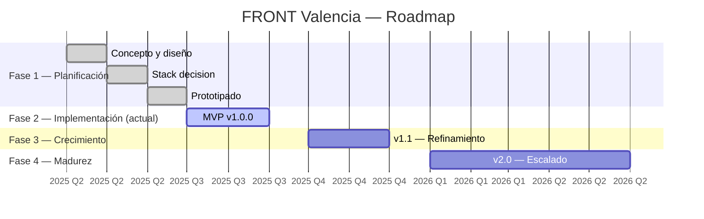

# Roadmap — FRONT Valencia

> **Restaurante y Terraza en La Marina de Valencia**
> Web: https://frontvalencia.com | Licencia: MIT

---

## Estado actual

```
FASE 1 ────► FASE 2 ◀══════●             FASE 3 ──► FASE 4 ──►
           (Planificación)  │           (Crecimiento)  (Madurez)
                            │
                   ●──●──●──●──●──●
                   ██▓▓░░░░░░░░░░░░
                   0%              100%
                   ↑ ACTUAL (Fase 2 — Implementación)
```

**Fase activa: Fase 2 — Implementación**

- CMS (Payload) configurado con colecciones y globales operativas
- Web (Astro 7 + React 19) scaffolded con páginas principales e i18n
- CI/CD funcional (GitHub Actions + Vercel + Railway)
- Monorepo Turborepo con toolchain completa
- Docker development environment listo

---

## Leyenda

| Símbolo | Significado     |
| ------- | --------------- |
| 🟢      | Prioridad Alta  |
| 🟡      | Prioridad Media |
| 🔵      | Prioridad Baja  |

| Símbolo | Esfuerzo               |
| ------- | ---------------------- |
| **S**   | Pequeño (≤1 semana)    |
| **M**   | Medio (1–3 semanas)    |
| **L**   | Grande (1–2 meses)     |
| **XL**  | Muy grande (2–4 meses) |

---

## Timeline visual

```text
Q3 2025                  Q4 2025                  Q1 2026                  Q2 2026
├────────────────────────┼────────────────────────┼────────────────────────┼────────────────────────┤
███ v1.0.0 ███▓▓▓▓▓▓▓▓▓▓░░ v1.1 ░░░▓▓▓▓▓▓▓▓▓▓░░░░░░ v2.0 ░░░░▓▓▓▓▓▓▓▓▓▓▓▓▓░░░░░░
```

---

## Milestone MVP — v1.0.0

> **Lanzamiento inicial.** Sitio completo con CMS operativo, carta digital, espacios, eventos y reservas.

| Prioridad | Área                 | Esfuerzo | Impacto                                    | Dependencias                     | Entregables                                                      |
| --------- | -------------------- | -------- | ------------------------------------------ | -------------------------------- | ---------------------------------------------------------------- |
| 🟢        | Core pages           | **M**    | Alto — visibilidad pública                 | Diseño aprobado                  | Home, Carta, Espacio, Localización, Reservas, 404                |
| 🟢        | CMS admin            | **M**    | Alto — operaciones del día a día           | Setup Payload                    | Panel admin con colecciones, globales, roles admin/editor        |
| 🟢        | Menu management      | **S**    | Alto — contenido principal del restaurante | CMS admin + colección MenuItems  | ABM de platos, categorías con orden, precios, alérgenos          |
| 🟢        | i18n es/en           | **M**    | Alto — alcance bilingüe                    | Schema de contenido localizado   | Rutas con prefijo de locale, contenido traducido, SEO por locale |
| 🟢        | SEO                  | **M**    | Medio — descubrimiento orgánico            | Core pages + i18n                | Sitemap, meta tags, OG images, robots.txt, structured data       |
| 🟢        | Responsive design    | **M**    | Alto — tráfico móvil mayoritario           | Tailwind config + layouts        | Diseño adaptativo móvil/tablet/desktop                           |
| 🟢        | CI/CD                | **S**    | Alto — despliegue continuo                 | Infraestructura Vercel + Railway | Pipelines CI, previews por PR, deploy automático a prod          |
| 🟢        | Docker dev           | **S**    | Medio — onboarding de desarrolladores      | Docker Compose                   | Entorno reproducible con Postgres + CMS + web                    |
| 🟡        | Espacio / Space page | **S**    | Medio — galería y descripción del local    | CMS colección Spaces             | Galería masonry, descripción del espacio, CTA eventos            |
| 🟡        | Events               | **M**    | Medio — promoción de eventos               | CMS colección Events             | Listado de eventos, detalle con imágenes, CTA a CoverManager     |
| 🟡        | Legal pages          | **S**    | Bajo — compliance legal                    | —                                | Aviso legal, privacidad, cookies, condiciones de reserva         |

**Progreso actual:** ~85%

| Componente                     | Estado         |
| ------------------------------ | -------------- |
| Web scaffold + core pages      | ✅ Completado  |
| CMS collections + globals      | ✅ Completado  |
| Monorepo + toolchain           | ✅ Completado  |
| i18n routing                   | ✅ Completado  |
| SEO + sitemap                  | ✅ Completado  |
| CI/CD pipelines                | ✅ Completado  |
| Docker dev                     | ✅ Completado  |
| Image storage (R2)             | ✅ Completado  |
| Contenido seed + scraping      | 🔄 En progreso |
| Tests (unit + e2e)             | 🔄 En progreso |
| Performance audit (Lighthouse) | ⬜ Pendiente   |
| Production deploy              | ⬜ Pendiente   |

---

## Milestone v1.1

> **Refinamiento.** Optimización de rendimiento, reservas online, analytics y accesibilidad.

| Prioridad | Área                          | Esfuerzo | Impacto                             | Dependencias                 | Entregables                                                     |
| --------- | ----------------------------- | -------- | ----------------------------------- | ---------------------------- | --------------------------------------------------------------- |
| 🟢        | Online reservations           | **M**    | Alto — conversión directa           | CoverManager API / widget    | Widget de reservas embebido con disponibilidad en tiempo real   |
| 🟢        | Rendimiento                   | **M**    | Alto — Core Web Vitals, UX          | Lighthouse baseline          | Optimización de imágenes, lazy loading, code splitting, caching |
| 🟢        | Accesibilidad (WCAG 2.1 AA)   | **L**    | Alto — compliance legal e inclusión | Audit axe-core               | Contraste, navegación teclado, ARIA labels, screen reader       |
| 🟢        | Analytics dashboard           | **M**    | Alto — toma de decisiones           | Meta Pixel + GA4             | Dashboard de visitas, conversiones, eventos                     |
| 🟡        | Advanced filtering            | **S**    | Medio — mejora UX de carta          | Colección MenuItems con tags | Filtros por alérgenos, dieta (vegano/GF), categoría, precio     |
| 🟡        | Image optimization pipeline   | **M**    | Medio — velocidad de carga          | R2 + sharp                   | WebP/AVIF automático, responsive images, blur placeholders      |
| 🟡        | Admin dashboard               | **M**    | Medio — gestión interna             | Payload admin + stats        | Vista de métricas, contenido pendiente, actividad reciente      |
| 🟡        | Error monitoring              | **S**    | Medio — estabilidad                 | Sentry / Logtail             | Captura de errores server y client, alertas                     |
| 🔵        | Página "Trabaja con nosotros" | **S**    | Bajo — recruiting                   | —                            | Formulario de candidatura, listado de vacantes                  |

---

## Milestone v2.0

> **Escalado.** Pedidos online, loyalty, PWA, cobertura multi-idioma completa, redes sociales y dashboard admin.

| Prioridad | Área                         | Esfuerzo | Impacto                         | Dependencias                     | Entregables                                             |
| --------- | ---------------------------- | -------- | ------------------------------- | -------------------------------- | ------------------------------------------------------- |
| 🟢        | Online ordering / takeaway   | **XL**   | Alto — nuevo canal de ingresos  | Integración con TPV / API propia | Carrito, checkout, pago online, preparación en cocina   |
| 🟢        | Loyalty program              | **L**    | Alto — retención de clientes    | Online ordering + auth           | Tarjeta de fidelización digital, puntos, recompensas    |
| 🟢        | PWA                          | **L**    | Alto — experiencia app-like     | Service worker, manifest         | Instalable offline, push notifications, cache first     |
| 🟡        | Multi-language full coverage | **L**    | Medio — alcance internacional   | i18n existente + traducciones    | Valenciano/catalán, francés, alemán, italiano           |
| 🟡        | Social features              | **M**    | Medio — comunidad               | Instagram API, Facebook API      | Feed social integrado, compartir platos, reviews        |
| 🟡        | Admin dashboard v2           | **L**    | Medio — operaciones avanzadas   | v1.1 admin + ordering + loyalty  | Gestión de pedidos, loyalty analytics, reportes         |
| 🔵        | Reservas grupo grandes       | **S**    | Bajo — casos de uso específicos | CoverManager API                 | Formulario de grupo, pre-aprobación, depósitos          |
| 🔵        | Catering / eventos privados  | **M**    | Bajo — ingresos adicionales     | CMS Events                       | Formulario de catering, landing de eventos corporativos |
| 🔵        | Blog / noticias              | **M**    | Bajo — contenido editorial      | CMS + Astro MDX                  | Recetas, noticias del restaurante, eventos especiales   |

---

## Hitos retrospectivos



---

## Riesgos y mitigaciones

| Riesgo                                           | Probabilidad | Impacto | Mitigación                                            |
| ------------------------------------------------ | ------------ | ------- | ----------------------------------------------------- |
| Cambios en API de CoverManager                   | Baja         | Alto    | Encapsular integración en adaptador; mock en tests    |
| Crecimiento de costes de infra (R2, Railway)     | Media        | Medio   | Monitorizar uso; cache CDN; optimizar assets          |
| Complexidad de i18n multi-lenguaje               | Media        | Medio   | Sistema de traducciones externo (POEditor / Crowdin)  |
| Dependencia de un solo proveedor de pagos (v2.0) | Baja         | Alto    | Stripe + alternativas; contract-first API de pagos    |
| Rendimiento en móvil con galería de imágenes     | Media        | Medio   | lazy loading nativo, responsive images, CDN           |
| SEO penalización por contenido duplicado (es/en) | Baja         | Alto    | hreflang correcto, canonical por locale, sitemap i18n |

---

## Principios de desarrollo

1. **Contract-first**: toda integración externa se modela como interfaz/contrato primero
2. **SEO desde el diseño**: metadatos, estructura semántica, rendimiento y accesibilidad no son añadidos tardíos
3. **i18n nativa**: el contenido nace bilingüe; la arquitectura no permite contenido no localizado
4. **Performance budget**: Lighthouse score ≥ 90 en todas las métricas para producción
5. **Accesibilidad obligatoria**: WCAG 2.1 AA como línea base; AAA como objetivo (v2.0)
6. **Open Source**: MIT License; el código es público y reusable
7. **AI-optimized**: contenido y markup diseñados para ser procesables por LLMs y crawlers semánticos
